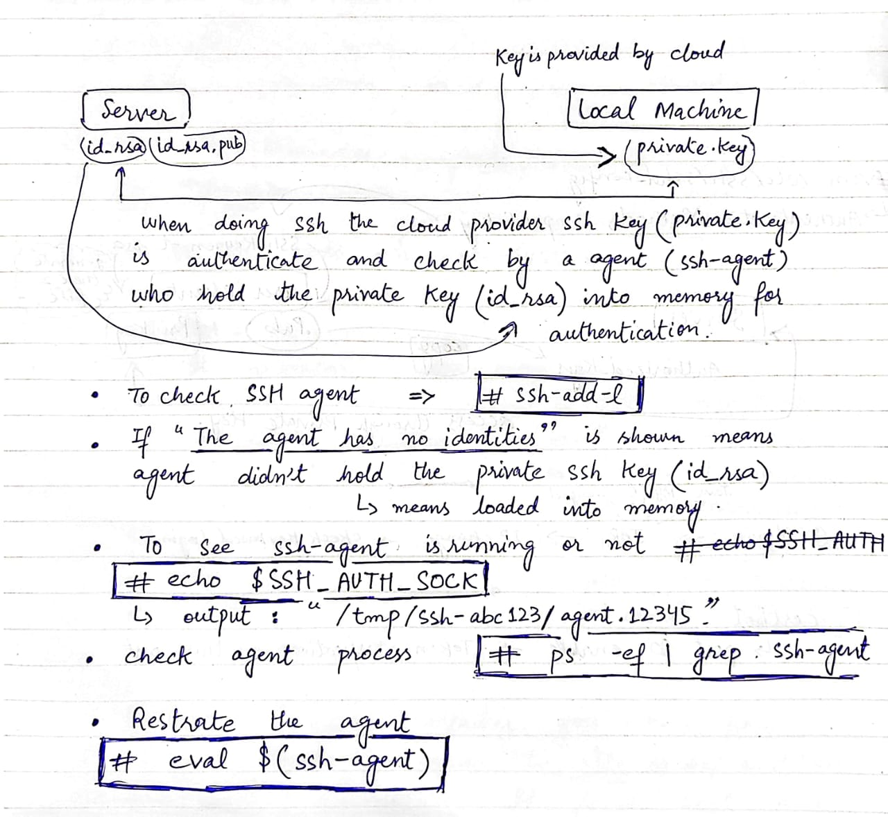

# SSH

=================================
             SSH
=================================

ensure that an SSH agent is running on the server. You can do this by running this command:
#ssh-add -l

=> The message "The agent has no identities" indicates that while the SSH agent is running, it currently does not have any SSH private keys loaded into memory for authentication
#ssh-add ~/.ssh/id_rsa

To see if ssh-agent is running or not:
#echo $SSH_AUTH_SOCK
  => If the output is a path (e.g., /tmp/ssh-abc123/agent.12345), then an SSH agent is running. If the output is empty, it means an SSH agent is not running.

check for SSH agent processes running
#ps -ef | grep ssh-agent

If you find that an SSH agent is not running, you can start one by running the ssh-agent command:
#eval $(ssh-agent)

=================================
              SSH
=================================

